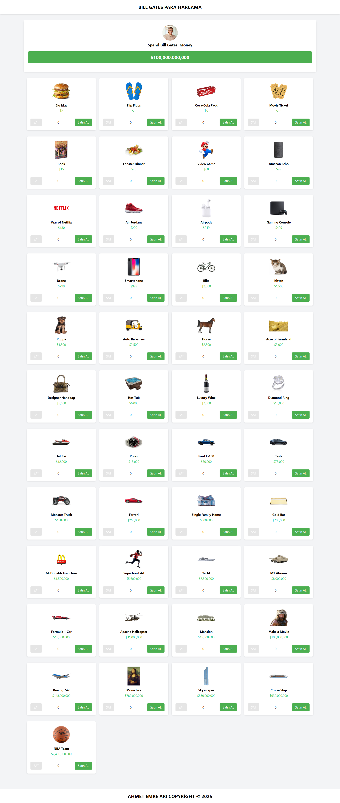

# Bill Gates Para Harcama Simülatörü

Bu proje, Bill Gates'in $100,000,000,000 servetini sanal olarak harcamanızı sağlayan interaktif bir web uygulamasıdır. Çeşitli ürünleri satın alabilir, satabilir ve toplam harcamanızı görüntüleyebilirsiniz.



## Özellikler

- Başlangıçta $100,000,000,000 bakiye
- Çeşitli ürünleri satın alma ve satma imkanı
- Ürün satın alındığında bakiyenin azalması
- Ürün satıldığında bakiyenin artması
- Hiç satın alınmamış ürünlerin "Sell" butonunun devre dışı kalması
- Bakiyeden daha pahalı ürünlerin "Buy" butonunun devre dışı kalması
- Satın alınan ürünlerin adetleri ve toplam bedellerinin alt kısımda listelenmesi

## Teknolojiler

- React
- Vite
- Tailwind CSS
- JavaScript

## Kurulum

1. Projeyi klonlayın
   ```bash
   git clone https://github.com/KULLANICI_ADINIZ/bill-gates-spending-app.git
   cd bill-gates-spending-app
   ```

2. Bağımlılıkları yükleyin
   ```bash
   npm install
   ```

3. Geliştirme sunucusunu başlatın
   ```bash
   npm run dev
   ```

4. Tarayıcınızda görüntüleyin
   ```
   http://localhost:5173
   ```

## Canlı Demo

[Canlı Demo Linki](https://UYGULAMA_LINKINIZ)

## İletişim

- LinkedIn: [LinkedIn Profiliniz](https://www.linkedin.com/in/KULLANICI_ADINIZ/)
- GitHub: [GitHub Profiliniz](https://github.com/KULLANICI_ADINIZ)

## Lisans

Bu proje [MIT](LICENSE) lisansı altında lisanslanmıştır.